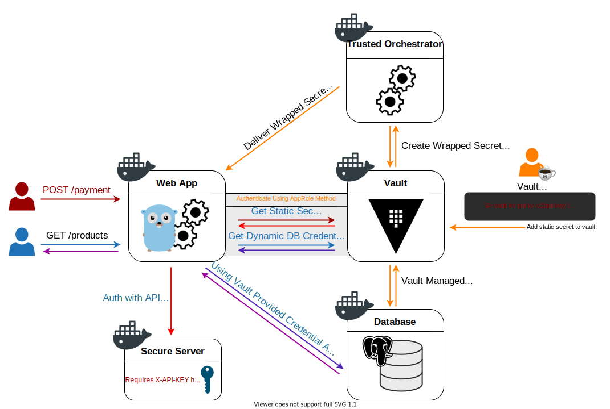

# hello-vault-go

This is a sample application that demonstrates how to authenticate to and
retrieve secrets from HashiCorp [Vault][vault].

## Prerequisites

1. [`docker`][docker] to easily run the application in the same environment
   regardless of your local operating system
1. [`docker compose`][docker-compose] to easily set up all the components of the
   demo (the application's web server, the Vault server, the database, etc.) all
   at once
1. [`curl`][curl] to test our endpoints
1. [`jq`][jq] _(optional)_ for prettier `JSON` output

## Try it out

> **WARNING**: The Vault server used in this setup is configured to run in
> `-dev` mode, an insecure setting that allows for easy testing.

### 1. Bring up the services

This step may take a few minutes to download the necessary dependencies.

```shell-session
./run.sh
```

```
[+] Running 8/8
 ⠿ Network hello-vault-go_default                          Created        0.1s
 ⠿ Volume "hello-vault-go_trusted-orchestrator-volume"     Created        0.0s
 ⠿ Container hello-vault-go-secure-service-1               Started        0.6s
 ⠿ Container hello-vault-go-database-1                     Started        0.6s
 ⠿ Container hello-vault-go-vault-server-1                 Started        1.3s
 ⠿ Container hello-vault-go-trusted-orchestrator-1         Started        8.6s
 ⠿ Container hello-vault-go-app-1                          Started       10.3s
 ⠿ Container hello-vault-go-healthy-1                      Started       11.7s

```

Verify that the services started successfully:

```shell-session
docker ps --format "table {{.Names}}\t{{.Status}}\t{{.Ports}}"
```

```
NAMES                                   STATUS                        PORTS
hello-vault-go-app-1                    Up About a minute (healthy)   0.0.0.0:8080->8080/tcp
hello-vault-go-trusted-orchestrator-1   Up About a minute (healthy)
hello-vault-go-vault-server-1           Up About a minute (healthy)   0.0.0.0:8200->8200/tcp
hello-vault-go-secure-service-1         Up About a minute (healthy)   0.0.0.0:1717->80/tcp
hello-vault-go-database-1               Up About a minute (healthy)   0.0.0.0:5432->5432/tcp
```

### 2. Try out `POST /payments` endpoint (static secrets workflow)

`POST /payments` endpoint is a simple example of the static secrets workflow.
Our service will make a request to another service's restricted API endpoint
using an API key value stored in Vault's static secrets engine.

```shell-session
curl -s -X POST http://localhost:8080/payments | jq
```

```json
{
  "message": "hello world!"
}
```

Check the logs:

```shell-session
docker logs hello-vault-go-app-1
```

```log
...
2022/01/11 20:29:01 getting secret api key from vault
2022/01/11 20:29:01 getting secret api key from vault: success!
[GIN] 2022/01/11 - 20:29:01 | 200 |    7.366042ms |   192.168.192.1 | POST     "/payments"
```

### 3. Try out `GET /products` endpoint (dynamic secrets workflow)

`GET /products` endpoint is a simple example of the dynamic secrets workflow.
Our application uses Vault's database secrets engine to generate dynamic
database credentials, which are then used to connect to and retrieve data from a
PostgreSQL database.

```shell-session
curl -s -X GET http://localhost:8080/products | jq
```

```json
[
  {
    "id": 1,
    "name": "Rustic Webcam"
  },
  {
    "id": 2,
    "name": "Haunted Coloring Book"
  }
]
```

Check the logs:

```shell-session
docker logs hello-vault-go-app-1
```

```log
2022/01/11 20:22:55 getting temporary database credentials from vault
2022/01/11 20:22:55 getting temporary database credentials from vault: success!
2022/01/11 20:22:55 connecting to "postgres" database @ database:5432 with username "v-approle-dev-read-SHPJSHXdVWJ5dTdE22TA-1641932575"
2022/01/11 20:22:55 connecting to "postgres" database: success!
...
[GIN] 2022/01/11 - 20:29:10 | 200 |    2.781958ms |   192.168.192.1 | GET      "/products"
```

### 4. Examine the logs for renew logic

One of the complexities of dealing with short-lived secrets is that they must be
renewed periodically. This includes authentication tokens and database
credential [leases][vault-leases].

> **NOTE**: it may be easier to see how the secrets are renewed in
> [this diagram](images/renew-diagram.svg).

Examine the logs for how the Vault auth token is periodically renewed:

```shell-session
docker logs hello-vault-go-app-1 2>&1 | grep auth
```

```log
2022/01/11 20:22:55 logging in to vault with approle auth; role id: demo-web-app
2022/01/11 20:22:55 logging in to vault with approle auth: success!
2022/01/11 20:22:55 auth token: successfully renewed; remaining duration: 120s
2022/01/11 20:24:21 auth token: successfully renewed; remaining duration: 120s
2022/01/11 20:25:47 auth token: successfully renewed; remaining duration: 120s
2022/01/11 20:27:13 auth token: successfully renewed; remaining duration: 120s
2022/01/11 20:27:33 auth token: successfully renewed; remaining duration: 120s
2022/01/11 20:28:34 auth token: successfully renewed; remaining duration: 105s
2022/01/11 20:28:34 auth token: can no longer be renewed; will log in again
2022/01/11 20:28:34 logging in to vault with approle auth; role id: demo-web-app
2022/01/11 20:28:34 logging in to vault with approle auth: success!
2022/01/11 20:28:34 auth token: successfully renewed; remaining duration: 120s
2022/01/11 20:29:58 auth token: successfully renewed; remaining duration: 120s
2022/01/11 20:31:23 auth token: successfully renewed; remaining duration: 120s
```

Examine the logs for database credentials renew / reconnect cycle:

```shell-session
docker logs hello-vault-go-app-1 2>&1 | grep database
```

```log
2022/01/11 20:22:55 getting temporary database credentials from vault
2022/01/11 20:22:55 getting temporary database credentials from vault: success!
2022/01/11 20:22:55 connecting to "postgres" database @ database:5432 with username "v-approle-dev-read-SHPJSHXdVWJ5dTdE22TA-1641932575"
2022/01/11 20:22:55 connecting to "postgres" database: success!
2022/01/11 20:22:55 database credentials: successfully renewed; remaining lease duration: 100s
2022/01/11 20:24:07 database credentials: successfully renewed; remaining lease duration: 100s
2022/01/11 20:25:20 database credentials: successfully renewed; remaining lease duration: 100s
2022/01/11 20:26:33 database credentials: successfully renewed; remaining lease duration: 82s
2022/01/11 20:27:33 database credentials: successfully renewed; remaining lease duration: 22s
2022/01/11 20:27:33 database credentials: can no longer be renewed; will fetch new credentials & reconnect
2022/01/11 20:27:33 getting temporary database credentials from vault
2022/01/11 20:27:33 getting temporary database credentials from vault: success!
2022/01/11 20:27:33 connecting to "postgres" database @ database:5432 with username "v-approle-dev-read-96y8N3aQdliwjo4bfpuD-1641932853"
2022/01/11 20:27:33 connecting to "postgres" database: success!
2022/01/11 20:27:33 database credentials: successfully renewed; remaining lease duration: 100s
2022/01/11 20:28:34 database credentials: can no longer be renewed; will fetch new credentials & reconnect
2022/01/11 20:28:34 getting temporary database credentials from vault
2022/01/11 20:28:34 getting temporary database credentials from vault: success!
2022/01/11 20:28:34 connecting to "postgres" database @ database:5432 with username "v-approle-dev-read-Yzob1xVLehrxpZzLIHJl-1641932914"
2022/01/11 20:28:34 connecting to "postgres" database: success!
```

> **NOTE**: the third time we fetch database credentials (at `20:28:34` in the
> log) is due to the auth token expiring. Any leases created by a token get
> revoked when the token is revoked, which includes our database credentials.

## Integration Tests

The following script will bring up the docker-compose environment, run the curl
commands above, verify the output, and bring down the environment:

```shell-session
./run-tests.sh
```

## Stack Design

### API

| Endpoint             | Description                                                            |
| -------------------- | ---------------------------------------------------------------------- |
| **POST** `/payments` | A simple example of Vault static secrets workflow (see example above)  |
| **GET** `/products`  | A simple example of Vault dynamic secrets workflow (see example above) |

### Docker Compose Architecture



[vault]:           https://www.vaultproject.io/
[vault-leases]:    https://www.vaultproject.io/docs/concepts/lease
[docker]:          https://docs.docker.com/get-docker/
[docker-compose]:  https://docs.docker.com/compose/install/
[curl]:            https://curl.se/
[jq]:              https://stedolan.github.io/jq/
