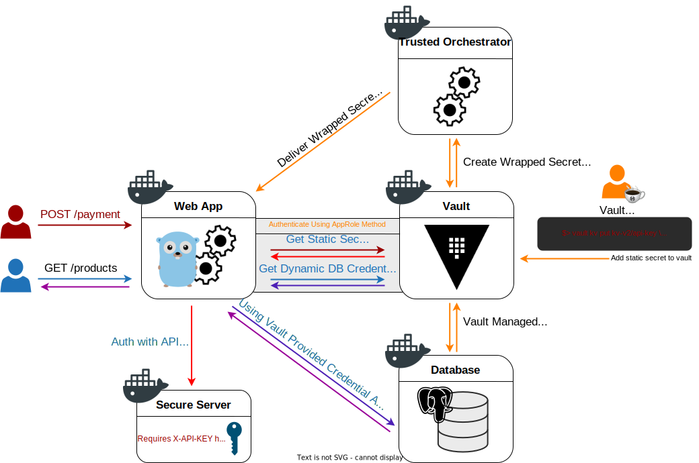

# hello-vault-go

This is a sample application that demonstrates how to authenticate to and
retrieve secrets from HashiCorp [Vault][vault].

## Prerequisites

1. [`docker`][docker] to easily run the application in the same environment
   regardless of your local operating system
1. [`docker compose`][docker-compose] to easily set up all the components of the
   demo (the application's web server, the Vault server, the database, etc.) all
   at once
1. [`curl`][curl] to test our endpoints
1. [`jq`][jq] _(optional)_ for prettier `JSON` output

## Try it out

> **WARNING**: The Vault server used in this setup is configured to run in
> `-dev` mode, an insecure setting that allows for easy testing.

### 1. Bring up the services

This step may take a few minutes to download the necessary dependencies.

```bash
./run.sh
```

```
[+] Running 8/8
 ⠿ Network hello-vault-go_default                          Created        0.1s
 ⠿ Volume "hello-vault-go_trusted-orchestrator-volume"     Created        0.0s
 ⠿ Volume "hello-vault-go_dbdata"                          Created        0.0s
 ⠿ Container hello-vault-go-db-1                           Started        0.9s
 ⠿ Container hello-vault-go-secure-service-1               Started        0.9s
 ⠿ Container hello-vault-go-vault-1                        Started        1.7s
 ⠿ Container hello-vault-go-trusted-orchestrator-1         Started        2.4s
 ⠿ Container hello-vault-go-app-1                          Started        3.1s

```

_(Optional):_ verify that the services started successfully

```bash
docker ps --format "table {{.ID}}\t{{.Status}}\t{{.Names}}\t{{.Ports}}"
```

```
CONTAINER ID   STATUS              NAMES                                   PORTS
f1ef46f7efb8   Up About a minute   hello-vault-go-app-1                    0.0.0.0:8080->8080/tcp
8c3e620f61ab   Up About a minute   hello-vault-go-trusted-orchestrator-1
87d80043a323   Up About a minute   hello-vault-go-vault-1                  0.0.0.0:8200->8200/tcp
db378af1e187   Up About a minute   hello-vault-go-secure-service-1         0.0.0.0:1717->80/tcp
0751700de59e   Up About a minute   hello-vault-go-db-1                     0.0.0.0:5432->5432/tcp
```

### 2. Try out `POST /payments` endpoint (static secrets workflow)

`POST /payments` endpoint is a simple example of the static secrets workflow.
Our service will make a request to another service's restricted API endpoint
using an API key value stored in Vault's static secrets engine.

```bash
curl -s -X POST http://localhost:8080/payments | jq
```

```json
{
  "message": "hello world!"
}
```

_(Optional):_ examine the logs

```bash
docker logs hello-vault-go-app-1
```

```log
...
2021/12/09 19:56:36 getting secret api key from vault
2021/12/09 19:56:36 getting secret api key from vault: success!
[GIN] 2021/12/09 - 19:56:36 | 200 |    3.219167ms |    192.168.96.1 | POST     "/payments"
```

### 3. Try out `GET /products` endpoint (dynamic secrets workflow)

`GET /products` endpoint is a simple example of the dynamic secrets workflow.
Our application uses Vault's database secrets engine to generate dynamic
database credentials, which are then used to connect to and retrieve data from a
PostgreSQL database.

```bash
curl -s -X GET http://localhost:8080/products | jq
```

```json
[
  {
    "id": 1,
    "name": "Rustic Webcam"
  },
  {
    "id": 2,
    "name": "Haunted Coloring Book"
  }
]
```

_(Optional):_ examine the logs

```bash
docker logs hello-vault-go-app-1
```

```log
2021/12/09 19:52:58 getting temporary database credentials from vault
2021/12/09 19:52:58 getting temporary database credentials from vault: success!
2021/12/09 19:52:58 connecting to "postgres" database @ db:5432
2021/12/09 19:52:58 connecting to "postgres" database: success!
...
[GIN] 2021/12/09 - 19:57:22 | 200 |    2.559083ms |    192.168.96.1 | GET      "/products"
```

## Stack Design

### API
| Endpoint             | Description                                                            |
| -------------------- | ---------------------------------------------------------------------- |
| **POST** `/payments` | A simple example of Vault static secrets workflow (see example above)  |
| **GET** `/products`  | A simple example of Vault dynamic secrets workflow (see example above) |

### Docker Compose Architecture


[vault]:           https://www.vaultproject.io/
[docker]:          https://docs.docker.com/get-docker/
[docker-compose]:  https://docs.docker.com/compose/install/
[curl]:            https://curl.se/
[jq]:              https://stedolan.github.io/jq/
